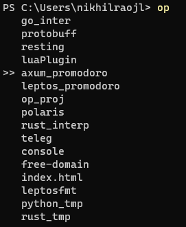

A simple program written in rust to quickly open projects in neovim. Works on both windows and linux.



## Run
Below is the layout expected for this program to run. Only "project" level in the layout is detected by this program
```
home
    |-Projects
        |-language
            |- project
            |- project
        |-language
            |- project
            |- project 
```

To list all the projects
```
op [--list|-l]
```

To directly open the project in nvim
```
op [project_name]
```
or print full path of the project using `--print` or `-p` flag. The output of `--print` or `-p` can be used to pipe in a shell
```
op test_proj -p | cd 
```

For auto complete in powershell you can add the below script profile
```powershell
$PROJECTSPATH = "$HOME\Projects\"
$IGNOREDIR = "$HOME\Projects\deploys*"
$opCommandCompletion = {
    param($stringMatch)
    $items  = @(Get-ChildItem -Path "$PROJECTSPATH\*\$stringMatch*" -Directory |
        Where-Object {$_.fullname -notlike $IGNOREDIR } |
        Select-Object -ExpandProperty name )

    $items
}

Register-ArgumentCompleter -Native -CommandName op -ScriptBlock $opCommandCompletion
```

For auto complete in bash you can add the below script rc file
```bash
PROJECTS_PATH="$HOME/[Pp]rojects/*/*"
IGNORE_DIR="$HOME/[Pp]rojects/deploys/*"
_op_completion() {
	if [ "${#COMP_WORDS[@]}" != "2" ]; then
		return
	fi

	COMPREPLY=($(compgen -W compgen -W "$(find ${PROJECTS_PATH} -mindepth 0 -maxdepth 0 -type d -not -path ${IGNORE_DIR} -printf "%f\n")" "${COMP_WORDS[1]}"))
}
complete -F _op_completion op
```

## Build
- requirements: rustc, cargo(you can have both by installing `rustup`), neovim
- clone the repo and cd into it
- `cargo test` for running tests
- run `cargo build --release --target_dir="somewhere/in/path"` to build and use binary
